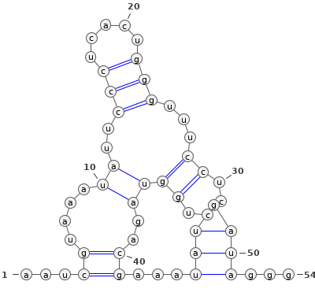
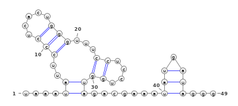
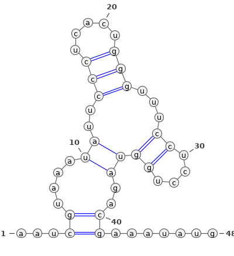
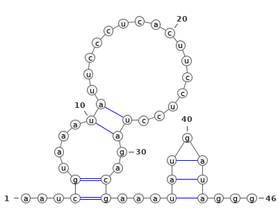
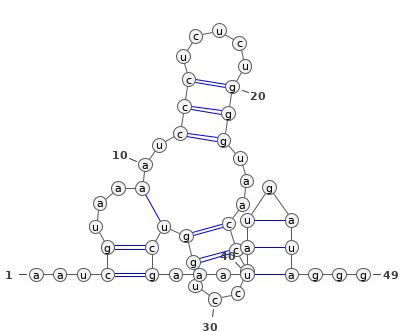
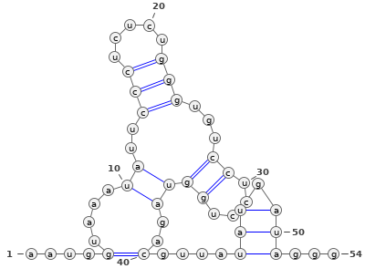
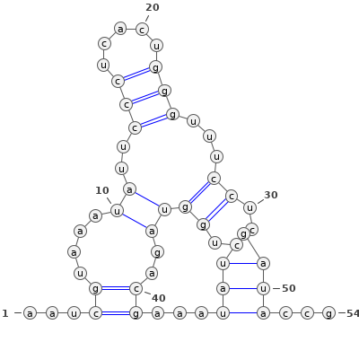
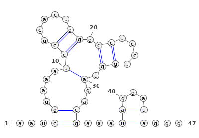
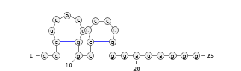

# Description

It's usual to encode secondary or tertiary structures for sequences as strings of specific sets of symbols. In this case, we have a string containing a set of nested parentheses, SQstr, which define sequence complementarity between the nucleotide sequences conforming the hairpins of an RNA molecule, namely SQref. We were provided with a set of similar RNA molecules that were aligned against our reference sequence. However, most RNA structure visalization tools cannot map the contacts string over different sequences. Thus, we need a Perl script that projects the contacts string for SQref on every sequence aligned to it. You must take into account that nucleotide substitutions can affect the pairings described by the set of parentheses. Furthermore, gaps in the alignment can delete sequence that is at the same position of an opening or closing paranthesis. So that, the script has to produce a specific contacts string for each sequence in the alignment but it has to ensure that all the parentheses are properly balanced. Those mismatched parenthesis should be replaced by a dot (".") in order to get a contacts string suitable for most visualization tools. The figure on the right shows the RNA secondary structure for SQref, it was generated by [VARNA 2D viewer](http://varna.lri.fr/demo.html) demo web server. You can include on the report a table with the adjusted 2D figure for each sequence. 

# Resolution

This solution is divided into 4 different parts, each of which corresponds to one of the main functions used in the script. The $5^{th}$ part corresponds to a graphical representation of the RNA secondary structure using VARNA software, available to download in []. The code itself is formed by 5 different functions: 4 of them correspond to the 4 main parts of the script, while the last one, named &genetic_hash, generates a hash that relates the bases that pair between them (A <-> U, C <-> G) in the RNA.

In order to calculate the secondary structure of different isoforms, first we need to stablish how we are storing the data in order to manipulate it in a proper way. As such, we'll be using different hashes and arrays to store the data properly. For example, the sequences readed from the file will be stored in a hash %seqs, so we can access to both the sequence ID and the sequence itself. 

## Command-line arguments

The script is executed as follows, being the first two mandatory and the third one optional.

```{}
./RNA_structurer.pl <input_filename> <desired_output_filename> [VARNA.jar]
```

The first paremeter the script recieves is the name of the file with the RNA reference sequence, its secondary structure, and the RNA sequences we want to obtain its structure. This file must be formated as follows:

+ The first line of the file correspond to the reference sequence, while the second one is its the secondary structure. The next lines can be whatever amount of RNA isoforms we want to calculate its structure.

+ The file have two different columns in every line, separated by tabs ('\\t'): the first one is the sequence ID, while the second one its the sequence itself. **The ID can be whatever unique alphanumerical ID we want to use, exept those which correspond to the reference sequence line and it structure: The ID of the sequence must be 'SQref' and the structure ID must be 'SQstr'**.

The second argument corresponds to the output file, where the sequences and it's corresponding structure will be save. The script will write 3 lines per sequence: The ID, the nucleotide sequence, and the strucure sequence

if no arguments or not enough are provided (<2), or too much of them are provided (> 3),the program exits saying how to use the script and saying that the script requires a file with rna sequences, or an output file. 


## Solving the problem

The function relies in the concept of 'depth'. Depth is the number of nested parenthesis we found while reading the sequence, that have not been closed. By tracking the number of open parenthesis we've read, we can establish pairs of basis that bond themselves.

**Note:** The progrman can halt here, if the sequence structure is not properly constructed. This can happen in two different scenarios: An open parenthesis that never closes, or a close parenthesis that doesn't have an equivelent open parenthesis. That is, if the value of depth is lesser than zero (at any time) or higher than zero after finishing reading the string.

The paired bases position (in the string) are saved in form of key-values. This way, whenever we have to change anything in both bases we only need one of them, the first one (the beggining of the string) and we can refer to the other one by using this hash.

This is useful while checking the mutations other string may have that deletes some bonds the reference sequence has. By saving the position, we can check if both bases match: if they do, the bond is kept, nothing is done; if not, the bond is deleted and substituted by a dot '.', meaning that those basis have no relation with any other one.

Once this guide is created, using the reference structure and reference sequence, we analyze the new sequences to calculate its structure. While reading the new sequences, different things can happen:

+ In position i, there is '.' in the structure. That means there are no bonds, and if the basis mutates, nothing else is affected. This is the easiest case. The structure of the new sequence in position i will be always be a '.'. 

+ In position i, there is an open parenthesis '('. This is the hardest case, as the algorithm checks if: 1) In the new sequence has lost this basis (substituted by '-'), and, thereford can't bond anymore, and 2) if the basis has mutated and thereford can no longer bond with the other basis. In both cases, the bond must be eliminated, and that means that the guide should be modified in the current basis and the basis with which bonds. Thus, this case checks if the bond is kept or not: if it's kept, does nothing, keeps the '(' in the new structure; Else, changes the guide in both postions, i, and the position that bonds with i, from '(' and ')' to a '.'.

+ In position i, there is a close parenthesis ')'. However, as every check has been done with the open parenthesis '(', a remaining ')' will already be checked to be bonded. The ')' will be kept.

## Issues

### Removing the gaps

The lost basis are represented with a dash '-'. That basis should be removed before being given to the VARNA representation tool, so a more representative structure will be obtained. Thus, every '-' found will be eliminated. They will be eliminated by position in their array or string, so we can also easily eliminate the structure asociated with that basis (which will be, after the check, a '.' for sure)

### Data structures

The main issues that were solved during the resolution of the problem were:

The construction of the guide that relates bonding basis. This could be addressed as different data structures, mainly an array or a hash. In the array we could use the index as the nucleotide postion, while the value stored at that index would be whether the position of the basis that this position. The other option was to use a hash to store only the basis that bond, with the position as the key and the value. Hovever, hashes doesn't accept integers as keys, but it does accept the string charachter equivelent, so we can convert them and use the hash structure without trouble. 

Using an array seemed not viable because using ordered indexes, requieres to have elements for every base on the genome. Most of them would store an element representing a '.', meaning that there's no bond. They wouldn't be used, and thus it will be a waste of memory and cpu. Using the hash we can only store the needed, bonding pairs, and access only to them, saving time and memory. 

### Complementary basis

In order to check if a bond is kept after a mutation, we need to now if the basis still matches. ¿How can we store the basis relations that allow or not bonds?

As it's a one-to-one relation with only 4 basis, by pairs, the easiest way is a hash, with key any basis and value the basis that bond with. This way we just need to check if the existing bases match with the key-value pair.

## Graphical representation of the structures

To create images of the different RNA structures, we need a third party library which, given the sequence and the structure, create the .png file. For this purpouse, we will use _VARNA_, a java library which do this work for us. This behaviour is coded inside the function &create_image(\$\$\$\$).

*Note:* In order to generate the images, the third parameter provided must be the route to the VARNA.jar file that will make the images. 

As parementers, VARNA needs the sequence and its structure. However, in order to keep some order, we can also use two extra parameters: an ID and a folder where to save the images. The filename will be <ID>.png. VARNA also admits other kind of image output files, like a vectorial SVG file. To simplify the code, we will just fix the output to PNG files.

|Sequence|Structure|Representation|
|--------|---------|--------------|
|Sqref|...((....((..(((.....)))...((....))))..))...(((.)))...|{height="100px" width="100px"}|
|Sq01|...((....((..(((.....)))...((....))))..))...(((.)))...|{height="100px" width="100px"}|
|Sq02|....((..(((.....)))...((....)))).......(((.)))...|{height="100px" width="100px"}|
|Sq03|...((....((..(((.....)))...((....))))..)).......|{height="100px" width="100px"}|
|Sq04|...((....((................))..))...(((.)))...|{height="100px" width="100px"}|
|Sq05|...((...(..(((.....)))...((....)))))...(((.)))...|{height="100px" width="100px"}|
|Sq06|....(....((..(((.....)))...((....))))..)....(((.)))...|{height="100px" width="100px"}|
|Sq07|...((....((..(((.....)))...((....))))..))...(((.)))...|{height="100px" width="100px"}|
|Sq08|...((....(((.....)).((....)).)..))...((...))...|{height="100px" width="100px"}|
|Sq09|.((.....))((....)).......|{height="100px" width="100px"}|
|Sq10|...((....((..(((.....)))...((....))))..))...(((.)))...|{height="100px" width="100px"}|

**Note:** The output of Varna.jar executable is redirected to Varna.log. This makes a cleaner output while conserving the output. Check this file if something goes wrong
